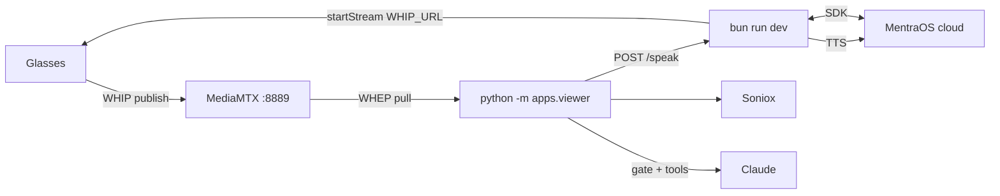

# Reflections

[](LICENSE)
[](https://www.python.org/)
[](https://mentra.glass)

A proactivity system with live perception, transcription, and memory for MentraOS smart glasses.

Reflections streams live audio and video from your glasses, runs perception locally, and builds durable memory of the people around you and the conversations you have with them.

## Demo

[](docs/DEMO_ASSETS.md)

> Live capture of the **Mentra Live** viewer (ASD bounding boxes, captions, proactive TTS) and the proactivity dashboard will land in a follow-up commit. See [docs/DEMO_ASSETS.md](docs/DEMO_ASSETS.md) for the capture guide if you'd like to record one against your own glasses.

<!-- After capture, replace the badge + note above with:


-->

## What it does

- **Real-time transcription** via Soniox with speaker attribution from active speaker detection
- **Face identity across sessions** — embed, label, and resolve names into a persistent gallery
- **Live captions** overlaid on the video feed, color-coded by speaker
- **Long-term memory** — press `s` to distill new conversation context into `memory.md`
- **Proactive responses** — a local Qwen 1.7B + LoRA gate (~200 ms) screens transcript updates; actionable turns reach Claude Haiku, which may speak through the glasses via TTS

## Architecture



Glasses publish WebRTC to **MediaMTX** (`:8889` WHIP/WHEP, `:8189` UDP media). The **Bun camera server** connects to MentraOS cloud for session control and forwards TTS. The **Python viewer** pulls the stream via WHEP, runs ASD + Soniox + a local Qwen gate + Claude proactivity, and draws the live overlay.

See [docs/ARCHITECTURE.md](docs/ARCHITECTURE.md) for threading details and component breakdown.

## Quickstart

**Prerequisites:** Bun, Python 3.10+, ngrok, MediaMTX binary in `mediamtx/`, MentraOS glasses on the same WiFi.

```bash
git clone <this-repo-url> reflections && cd reflections
cp .env.example .env          # fill in credentials — see docs/CONFIGURATION.md
bun install
pip install -e .
```

Download model weights into `models/` — see [docs/MODELS.md](docs/MODELS.md).

Then follow the **[five-terminal setup guide](docs/SETUP.md)**:

| Terminal | Command |
|----------|---------|
| 1 | `ngrok http 3000` |
| 2 | `./mediamtx/mediamtx ./mediamtx/mediamtx.yml` |
| 3 | `bun run dev` |
| 4 | `python -m apps.viewer` |
| 5 | `python -m proactivity.dashboard` *(optional)* |

Launch the app on your glasses from the MentraOS phone app. A **"Mentra Live"** window opens on your laptop.

### Keyboard controls

| Key | Action |
|-----|--------|
| `s` | Snapshot transcript to memory |
| `p` | Test TTS phrase |
| `m` | Mute / unmute proactivity |
| `q` | Quit (saves face gallery) |

## Documentation

| Doc | Contents |
|-----|----------|
| [SETUP.md](docs/SETUP.md) | Full local workflow, Windows PowerShell notes, troubleshooting |
| [ARCHITECTURE.md](docs/ARCHITECTURE.md) | Threading model, data flow, repo layout |
| [CONFIGURATION.md](docs/CONFIGURATION.md) | All environment variables |
| [PROACTIVITY.md](docs/PROACTIVITY.md) | Gate thresholds, tools, dashboard |
| [MODELS.md](docs/MODELS.md) | Weight downloads and cache |
| [PRIVACY.md](docs/PRIVACY.md) | Data captured, storage, reset |
| [DEMO_ASSETS.md](docs/DEMO_ASSETS.md) | Capture `demo.gif` and `dashboard.png` for release |

## Project structure

```
apps/
  camera-server/     Bun/TS MentraOS SDK server
  viewer/            python -m apps.viewer entrypoint
packages/
  stream/            WHEP source, ASD, Soniox, captions, identity
  proactivity/       Classifier gate, Claude agent, tools
  reflections/       Shared config and env loading
  third_party/       Vendored LR-ASD
models/              ONNX weights + face gallery (runtime)
docs/                Documentation
```

## Contributing

Pull requests and issues are welcome. See [CONTRIBUTING.md](CONTRIBUTING.md)
for the development workflow, [AGENTS.md](AGENTS.md) for the architecture
reference, and [SECURITY.md](SECURITY.md) to report vulnerabilities
privately. By participating you agree to the [Code of Conduct](CODE_OF_CONDUCT.md).

## License

MIT — see [LICENSE](LICENSE), [NOTICE](NOTICE), and
[THIRD_PARTY_NOTICES.md](THIRD_PARTY_NOTICES.md).

## Links

- [MentraOS docs](https://docs.mentra.glass/camera)
- [MentraOS console](https://console.mentra.glass/)
