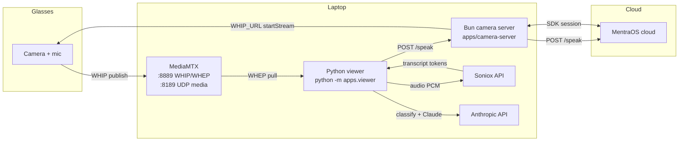
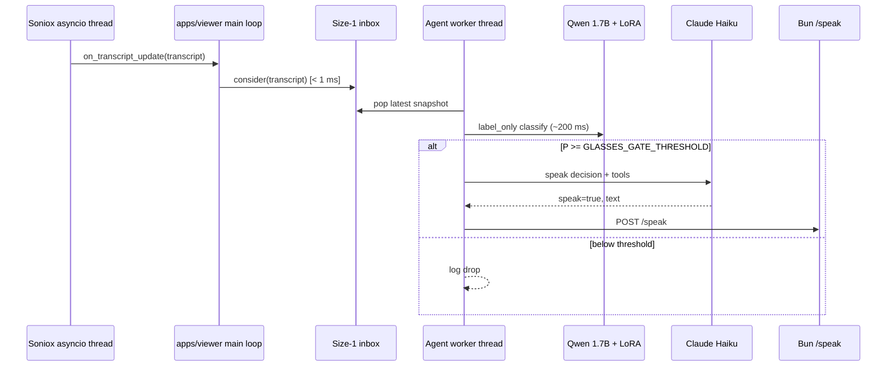

# Architecture

Reflections is a hybrid **Bun/TypeScript + Python** system for MentraOS smart glasses. The glasses publish live A/V over WebRTC; a local Python viewer runs perception, transcription, and proactivity; a Bun app server bridges MentraOS cloud control (stream start/stop, TTS, optional cloud transcripts).

## Data flow



The Bun server and Python viewer **do not talk directly for video**. MediaMTX is the media bus. The viewer optionally consumes `/transcripts` SSE from the Bun server when `USE_MENTRA_TRANSCRIPTION=true`; by default transcription runs locally via Soniox for lower latency and tighter ASD attribution.

## Repository layout

| Path | Role |
|------|------|
| `apps/camera-server/` | MentraOS SDK app server — starts WHIP stream, `/speak`, `/transcripts` SSE |
| `apps/viewer/` | WHEP viewer entrypoint (`python -m apps.viewer`) |
| `packages/stream/` | aiortc source, processor pipeline, ASD, Soniox, captions, identity |
| `packages/proactivity/` | Local Qwen gate, Claude agent, tools, dashboard |
| `packages/reflections/` | Shared config (`config.py`), env loader, logging |
| `packages/third_party/lr_asd/` | Vendored LR-ASD weights |
| `models/` | ONNX weights + runtime face gallery (gitignored) |

## Threading model

### WHEP source (`packages/stream/source.py`)

- **Main thread**: synchronous `frames()` iterator — yields `VideoItem` / `AudioItem` to the viewer loop.
- **Background daemon thread** (`whep-loop`): owns an asyncio event loop, maintains the aiortc peer connection, decodes frames, pushes into a size-16 queue (drops oldest on backpressure).

### Processor pipeline (`packages/stream/pipeline.py`)

Each processor declares `mode`:

| Mode | Thread | Use case |
|------|--------|----------|
| `sync` | Render thread (inline with `cv2.imshow`) | Cheap per-frame work — YuNet detection, IoU tracking, caption overlay |
| `async` | Dedicated worker thread + size-256 inbox (drops oldest) | Slow models — LR-ASD inference, Soniox WebSocket I/O |

The viewer main loop:

```
for item in source.frames():
    dispatch video/audio → pipeline.draw() → cv2.imshow()
```

### Active speaker detection (`packages/stream/processors/asd/`)

- **Sync path**: YuNet face detect (every N frames), IoU tracker, crop buffers, audio ring buffer, MFCC extraction.
- **Async worker**: LR-ASD PyTorch forward pass on a size-1 inference queue (evicts stale batches — always processes the freshest).
- **Identity worker**: face embeddings enrolled only while a track is actively speaking.

### Soniox transcription (`packages/stream/processors/soniox/`)

- **Async asyncio thread**: persistent WebSocket, send-audio loop, recv loop, keepalive, dwell timer.
- **`on_transcript_update`**: fires on speaker flip (200 ms debounced), sentence terminator, Soniox `<end>` token, or 0.5 s dwell. Payload is the full cumulative `[(speaker, text), …]` transcript.

### Proactivity agent (`packages/proactivity/agent/`)



- **Soniox thread** calls `_on_transcript_update` in `apps/viewer/cli.py` — must return immediately.
- **Daemon worker thread**: pops from size-1 queue; rapid updates evict stale snapshots.
- **Speak / memory snapshots**: additional daemon threads so the render loop never blocks.

## Perception pipeline

1. **Transcription** — Soniox WebSocket; finals attributed to speakers via ASD `who_spoke()`.
2. **Active speaker detection** — LR-ASD over 10-frame 112×112 crops + MFCC audio; 15→25 fps pulldown for 4:1 audio-to-video ratio.
3. **Identity** — MobileFaceNet embeddings in a persistent gallery (`models/face_gallery.npz` + `.json`). New faces → `"Person N"`; on exit Claude resolves names and the gallery is flushed.

## Key entrypoints

| Command | Purpose |
|---------|---------|
| `bun run dev` | Start MentraOS camera server |
| `python -m apps.viewer` | WHEP viewer + full processor pipeline |
| `python -m proactivity.dashboard` | Live prompt/decision debugger (port 8766) |

## Related docs

- [Setup](SETUP.md) — five-terminal local workflow
- [Configuration](CONFIGURATION.md) — environment variables
- [Proactivity](PROACTIVITY.md) — gate thresholds, tools, dashboard
- [Models](MODELS.md) — weight downloads and cache locations
- [Privacy](PRIVACY.md) — data captured, storage, reset procedure
