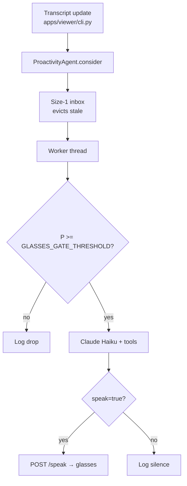

# Proactivity

The proactivity pipeline decides when the glasses should speak unprompted — screening every transcript update with a local classifier, then optionally calling Claude with memory, tools, and recent conversation context.

## Pipeline overview



Entry point: `packages/proactivity/agent/`, fed by `_on_transcript_update` in `apps/viewer/cli.py`.

## Two thresholds — do not conflate them

| Knob | Location | Default | Used by |
|------|----------|---------|---------|
| **`GLASSES_GATE_THRESHOLD`** | `packages/reflections/config.py` (env override) | **0.25** | **Live glasses path** — `ProactivityAgent.threshold` |
| **`REASONING_TRIGGER`** | `packages/proactivity/classifier.py` (hard-coded) | **0.45** | Smoke scripts only (`scripts/smoke_full_transcript.py`, `scripts/smoke_server.py`) |

The live path calls `_label_only_classify()` (~200 ms, no reasoning text) and gates on **`GLASSES_GATE_THRESHOLD` only**. It ignores the classifier's `label` field entirely.

`REASONING_TRIGGER` decides whether the **full** `classify()` path generates a slow reasoning string. That path is for offline evaluation and debugging — not for glasses.

To make the agent more or less chatty in production, adjust:

```bash
GLASSES_GATE_THRESHOLD=0.30   # stricter (fewer Claude calls)
GLASSES_GATE_THRESHOLD=0.20   # more permissive
```

## Agent gates

Override via `ProactivityAgent` constructor kwargs in `apps/viewer/cli.py`:

| Parameter | Default | Purpose |
|-----------|---------|---------|
| `min_consider_interval_s` | `1.0` | Minimum gap between classify runs |
| `min_claude_interval_s` | `0.0` | Claude cooldown (0 = serialize naturally via worker) |
| `min_speak_interval_s` | `2.0` | Minimum gap between TTS calls |
| `repeat_text_window_s` | `30.0` | Suppress repeating the same spoken text |
| `recent_turns` | `10` | Transcript turns included in Claude prompt |

Press **`m`** in the viewer to mute TTS without stopping classification. Press **`s`** to snapshot new transcript content into `memory.md`.

## Tools

Two separate tool lists serve different purposes:

### Classifier vocabulary (`_DEFAULT_TOOLS` in `agent/prompts.py`)

Training vocabulary shown to the Qwen gate so it recognizes actionable utterances ("find ramen nearby", "remind me at 3"). Names do **not** map 1:1 to Anthropic tools.

```
send_message, create_reminder, google_search,
google_maps_find_places, google_maps_find_nearest_place,
google_maps_get_place_details,
google_calendar_list_events, google_calendar_create_event,
google_calendar_check_availability
```

### Anthropic tools (`packages/proactivity/tools/`)

Built by `build_anthropic_tools()` (re-exported from `packages/proactivity/tools/__init__.py`) for Claude Haiku calls:

| Tool | Type | Requires |
|------|------|----------|
| `web_search` | Server-side (Anthropic executes) | `ANTHROPIC_API_KEY` |
| `places_search` | Client-side | `GOOGLE_MAPS_API_KEY` |
| `place_details` | Client-side | `GOOGLE_MAPS_API_KEY` |
| `directions` | Client-side | `GOOGLE_MAPS_API_KEY` |
| Calendar tools | Client-side OAuth | `GOOGLE_OAUTH_*` vars |

Default location bias comes from `DEFAULT_LOCATION_*` env vars — set these to your area before relying on place search in the field.

## Memory

- `memory.md` at repo root is read on every classify call (`parse_memory_file`).
- Press **`s`** in the viewer to send transcript deltas to Claude via `MemoryAgent` (`packages/proactivity/memory_agent.py`).
- Copy `memory.example.md` → `memory.md` for a starter template.

## Dashboard

Live debugging without instrumenting from scratch:

```bash
python -m proactivity.dashboard
```

Opens `http://127.0.0.1:8766/` (override with `DASHBOARD_PORT`). Tails `proactivity_prompts.jsonl` — classifier prompts, Claude requests/responses, tool calls. `POST /reset` truncates the log.

Decision summaries also append to `proactivity_decisions.log` (classifier P, skip reason, spoken text).

## Smoke utilities

| Command | Purpose |
|---------|---------|
| `python -m proactivity.cli` | Interactive proactivity CLI |
| `python scripts/smoke_server.py` | HTTP test server with full classify path (open `http://127.0.0.1:8765/`) |
| `python scripts/smoke_full_transcript.py` | Offline transcript replay |
| `python scripts/smoke_pipeline.py` | Drive the agent through canned synthetic probes |

These paths use the full `classify()` path with `REASONING_TRIGGER` — not the live label-only gate.

## Related docs

- [CONFIGURATION.md](CONFIGURATION.md) — env vars for API keys and thresholds
- [ARCHITECTURE.md](ARCHITECTURE.md) — threading model
- [PRIVACY.md](PRIVACY.md) — what leaves the device when tools fire
